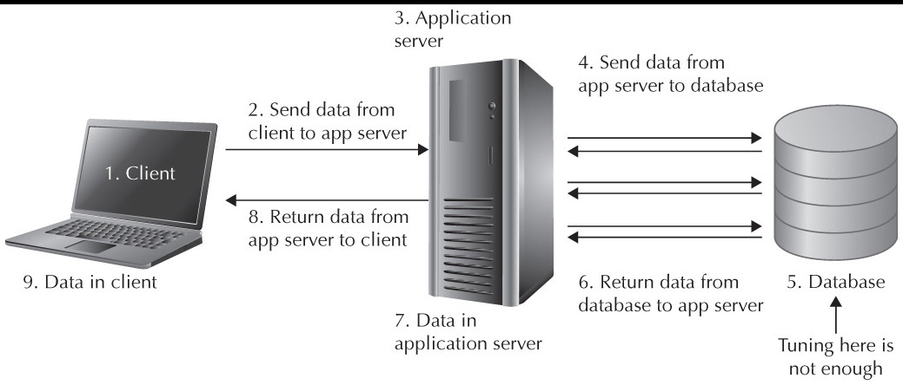

# Databases
## What is Database?
>A database is an organized collection of structured information, or data, typically stored electronically in a computer system. A database is usually controlled by a database management system (DBMS). Together, the data and the DBMS, along with the applications that are associated with them, are referred to as a database system, often shortened to just database.
## We can store The data in a file like json, xml or csv, so why databases?
>That is true and OK for small projects, but for big projects, thry may use a lot of data, then we will have a big file to handle, read/write/edit/delete thes operations takes a processing time because the file is too big and stored in disk driver, and also this file is accessable for others (The data are not safe!), But in databases, the data will be ready in RAM, so it's easy and fast to reach, and it's in safe place, no one can get this data without permission.

## What’s the difference between a database and a spreadsheet?
>Databases and spreadsheets (such as Microsoft Excel) are both convenient ways to store information. The primary differences between the two are:
>1. How the data is stored and manipulated
>2. Who can access the data
>3. How much data can be stored
>Spreadsheets were originally designed for one user, and their characteristics reflect that. They’re great for a single user or small number of users who don’t need to do a lot of incredibly complicated data manipulation. Databases, on the other hand, are designed to hold much larger collections of organized information—massive amounts, sometimes. Databases allow multiple users at the same time to quickly and securely access and query the data using highly complex logic and language.

## Types of databases:
>There are many different types of databases. The best database for a specific organization depends on how the organization intends to use the data.
><ul><li>Relational databases</li><li>Object-oriented databases</li><li>Distributed databases</li><li>Data warehouses</li><li>NoSQL databases</li><li>Graph databases</li><li>OLTP databases</li><li>Open source databases</li><li>Cloud databases</li><li>Multimodel database</li><li>Document/JSON database</li><li>Self-driving databases</li></ul>

## Work Flow in Webservers:

## Mongodb as a Database
> MongoDB is a source-available cross-platform document-oriented database program. Classified as a NoSQL database program, MongoDB uses JSON-like documents with optional schemas. MongoDB is developed by MongoDB Inc. and licensed under the Server Side Public License.

Go to [Installiation](./install-mongodb/README.MD) Guid