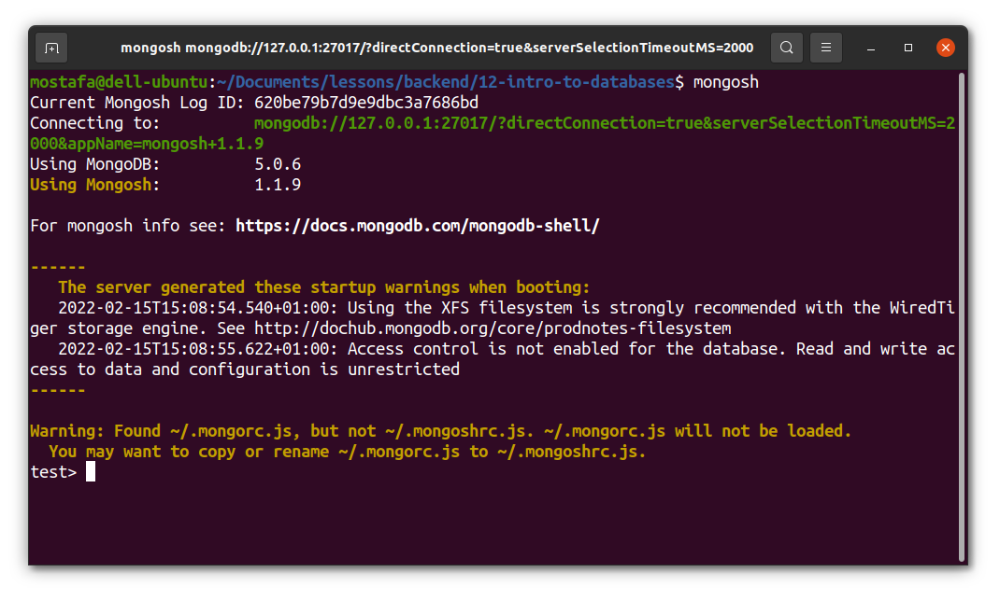

# Mongo shell Commands

> After installing Mongo locally, open Terminal, and hit ``` mongosh ``` or ``` mongo ```.
> Then mongo Shell should open like bellow


If not, propably mongo service is not running, so you should hit in terminal ``` sudo systemctl start mongod ```

Or mongo is not installed, go to [this file](../install-mongodb/README.MD) to and follow the instructions to install it.

## important Mongo Shell Commands:

### 1. Show databases
```sh
show databases
#or
show dbs
```
### 2. switch to database
```sh
use database_Name
```
if "database_Name" exist, shell will switch to it, if not, no error and after any data inserting, a new data base will be created.
### 3. show collections
```sh
show collections 
``` 
### 4. show data
after switching to any database, use ```db``` then db will refare to current database

to show data use now:
```sh
db.COLLECTION.find()
# where COLLECTION is the name of the collection that the data we need to show there.
# after find() we can use .pretty() just to show data in good format
db.COLLECTION.find().pretty()
```

### 5. Filter or looking for some data
We can use same previous command ```find()``` and we pass inside it an object as a filter
```sh
db.COLLECTION.find({name: "someName"}).pretty()
# we call {name: "someName"} a query or filter.
```
### 6. Insert Data
we can insert data to some collection by this command:
```sh
db.COLLECTION.insertOne({name: "someName"})
# You can store object using .insertOne
# note that if COLLECTION is not exist, so a new COLLECTION will be created and this new object will be stored in it.
# You can use an other method to store .insertMany()
# In this case you have to pass inside an array of objects, so that each object will be as a new Record
db.COLLECTION.isertMany([{name: "name1"}, {name: "name2"},{}...])
```
### 7. Delete Record:
To delete multiple documents, use ```db.COLLECTION.deleteMany()```.

To delete a single document, use ```db.COLLECTION.deleteOne()```.
```sh
# also we have to pass a filter or query inside
db.COLLECTION.deleteOne({name: "any"})
# if there is more than one record, then the first one will be deleted.
```
### 8. update Data:
To update a single document, use ```db.COLLECTION.updateOne()```.

To update multiple documents, use ```db.COLLECTION.updateMany()```.

To replace a document, use ```db.COLLECTION.replaceOne()```.
```sh
# change two values from one record:
db.COLLECTION.updateOne({name: "any"}, {$set: {name: "any", any: "any"}})
# note the first argument is the filter or queryand the second argument is the new object.
# note If more than record founded, then only the first one will be updated.
#  If we have a nested object like this:
# {
#    name: "any",
#    address: {
#        country: "CHANGE_ME",
#        code: 2222
#    }
# }
# To change country we use like this:
db.COLLECTION.updateOne({name: "any"}, {$set: {"address.country": "Germany"}})
# UpdateMany() will update all matches records NOT only the first one.
```
### 9. Delete Collection:
```sh
db.COLLECTION.drop()
```
### 10. Delete Database:
```sh
db.dropDatabase()
```
> ### Read more about Mongo shell commands in [official mongo documentation](https://docs.mongodb.com/manual/reference/mongo-shell/) site.